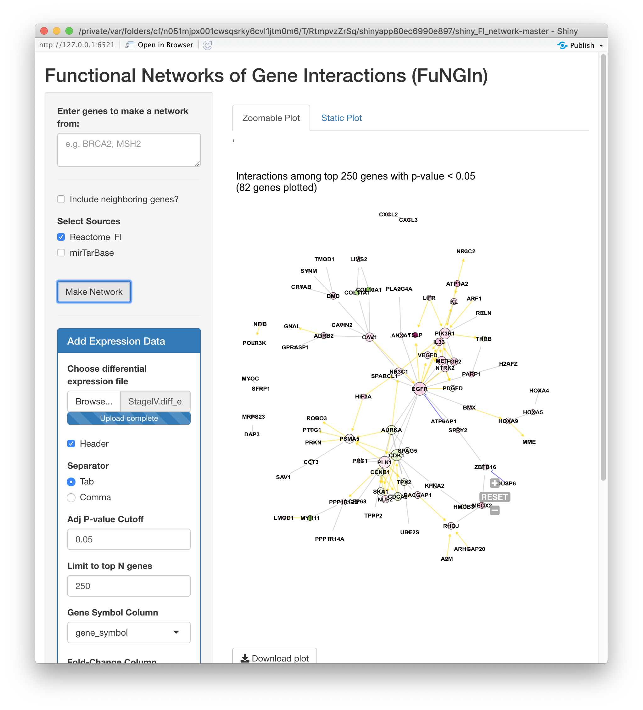

# Functional Networks of Gene Interactions (FuNGIn)
*like fun+engine*
 
## Shiny app for plotting gene functional interaction networks

So far, the idea is that you can view interactions among gene(s) of interest, and overlay expression data if available, OR view interactions among your *top N significant genes* from uploaded data
 
* [Use cases:](#use-cases)
* [How to run](#how-to-run)
   * [Install Required Packages](#install-required-packages)
   * [Run from GitHub in RStudio](#run-from-github-in-rstudio)
* [Differential Expression Data](#differential-expression-data)
* [Data Sources](#data-sources)
   * [Reactome FI](#reactome-fi)
   * [miRNA Targets](#mirna-targets)
* [To Do](#to-do)

# Use cases:
- Enter a few genes to view their interacting neighbors, e.g. `BRCA2,MSH2`
    
- Enter mature microRNA(s) to view their interacting neighbors (targets)
    * Select at least `mirTarBase` as the data source
    * Select "Reactome_FI" to view interactions among target genes also
    
- Use expression data with any combination of the above
    * Use top differentially expressed genes from a file
    
    * Enter query genes and overlay expression information
    

## How to run
### Install R and RStudio
Here's an [installation guide](http://www.sthda.com/english/wiki/installing-r-and-rstudio-easy-r-programming) if you don't have these already.

### Install Required Packages
```
list.of.packages <- c("shiny","shinyjs","shinyBS","openxlsx","igraph","qgraph","ggnetwork","network","intergraph","RColorBrewer","ggnewscale","svgPanZoom","gridSVG","shinycssloaders","shinyWidgets")
new.packages <- list.of.packages[!(list.of.packages %in% installed.packages()[,"Package"])]
if(length(new.packages)) install.packages(new.packages)

list.of.bioc.packages <- c("maftools")
if (!requireNamespace("BiocManager", quietly = TRUE))
    install.packages("BiocManager")
new.bioc.packages <- list.of.bioc.packages[!(list.of.bioc.packages %in% installed.packages()[,"Package"])]
if(length(new.bioc.packages)) BiocManager::install(new.bioc.packages)
```

### Run from GitHub in RStudio
```
library(shiny)
runGitHub( "shiny_FI_network", "mtandon09", ref="with_mirna")
```


## Differential Expression Data

You can also upload a tab/comma-delimited or .xlsx file with differential expression information.
The following data are recognized:
- HUGO Gene Symbol (required)
- Fold-change Value (log fold-change values make for better coloring)
- Significance Value (adjusted p-value, FDR, etc.)


## Data Sources
### Reactome FI
From the Wu et. al [2010 paper](https://genomebiology.biomedcentral.com/articles/10.1186/gb-2010-11-5-r53), this dataset expands on the Reactome pathway database by adding annotation data.
>We have constructed a protein functional interaction network by extending curated pathways with non-curated sources of information, including protein-protein interactions, gene coexpression, protein domain interaction, Gene Ontology (GO) annotations and text-mined protein interactions, which cover close to 50% of the human proteome.

The data can be found in the [Downloads page at Reactome](https://reactome.org/download-data) under "Functional interactions (FIs) derived from Reactome, and other pathway and interaction databases".
### miRNA Targets
miRTarBase [[paper]](https://www.ncbi.nlm.nih.gov/pmc/articles/PMC5753222/)[[website]](http://mirtarbase.cuhk.edu.cn/php/index.php)


# To Do
- Enable file upload to overlay mutation data
- Lots of control flow changes for better Shiny-ness
- Lots of aesthetic changes for the network plot
    * Legends don't really work/look crappy
- Lots of UI changes
